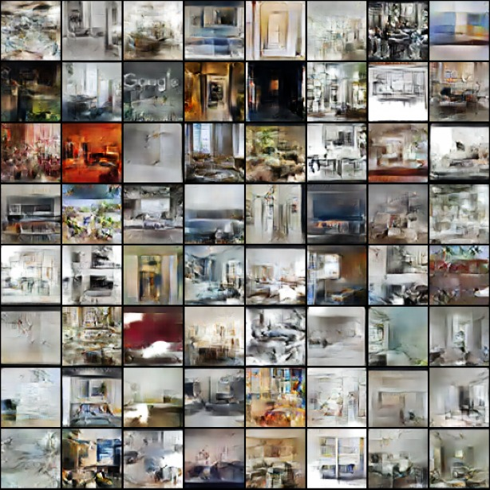

# Generation of indoor images with simple GAN




## Prerequisites
- Python 3.x
- PyTorch
- Jupyter Notebook

## Installation
Clone the repository and install the necessary dependencies.
```
git clone https://github.com/yourusername/Google_Scrapping.git
pip install -r requirements.txt
```

## License
This project is open-sourced under the MIT License.
